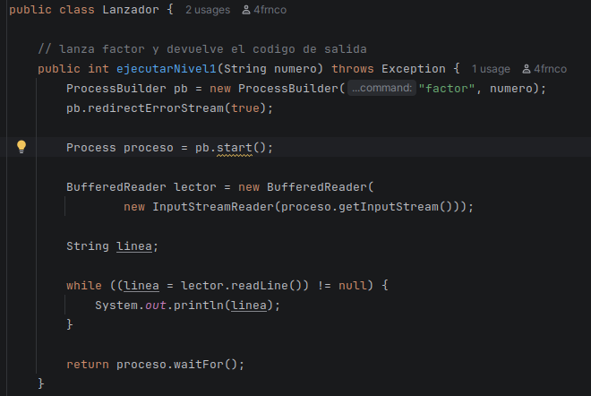
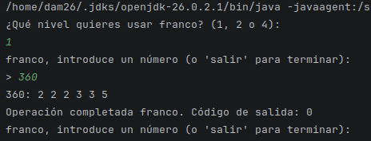
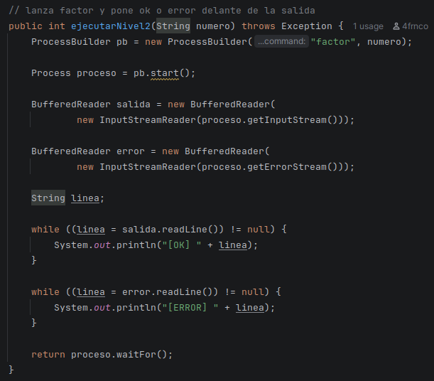
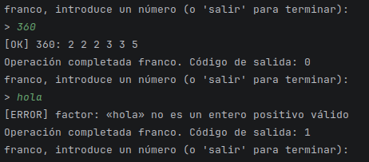
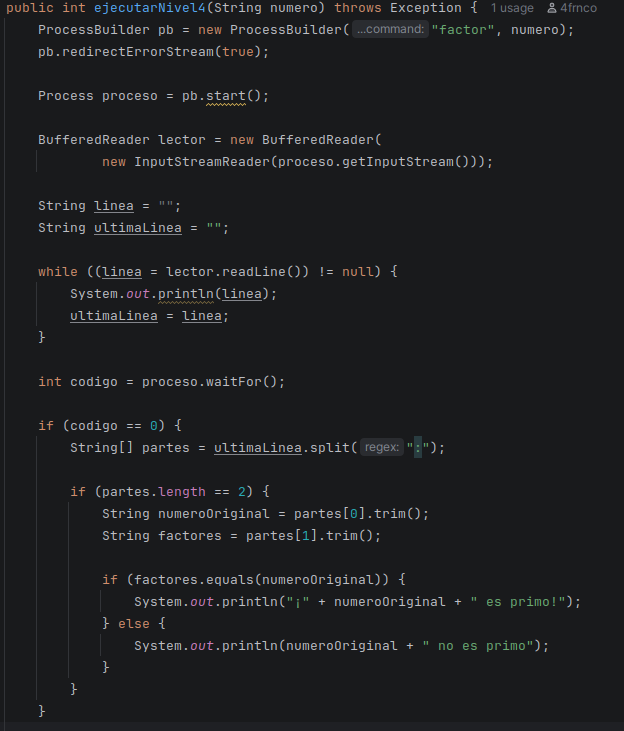
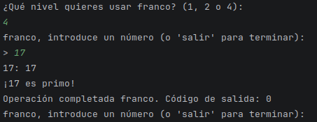
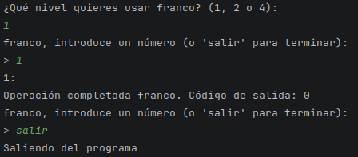
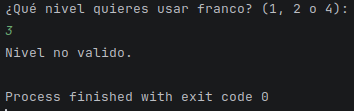

# Tarea 05 - Auditoría Cósmica: El Detector de Primos

Franco Naraza

## Niveles realizados

En esta práctica se han realizado los siguientes niveles:

- **Nivel 1:** ejecución del comando `factor` y muestra de su salida.
- **Nivel 2:** muestra de la salida indicando `[OK]` o `[ERROR]`.
- **Nivel 4:** comprobación de si el número es primo.

El **nivel 3 no lo he realizado**.

## Funcionamiento

El programa utiliza `ProcessBuilder` para ejecutar el comando de Linux:

```bash
factor número
```

Al iniciar el programa se selecciona el nivel que se quiere utilizar. Después se pueden introducir números continuamente. Para terminar el programa hay que escribir:

```text
salir
```

## Nivel 1



Muestra directamente el resultado de `factor` y el código de salida.

Ejemplo:

```text
Introduce un número (o 'salir' para terminar):
> 360
360: 2 2 2 3 3 5
Operación completada. Código de salida: 0
```
Salida en terminal:


## Nivel 2

La salida correcta aparecerá con `[OK]` y los errores con `[ERROR]`.

Ejemplo:

```text
> 360
[OK] 360: 2 2 2 3 3 5
Operación completada. Código de salida: 0
```
Salida en terminal:



## Nivel 4


Además de mostrar el resultado de `factor`, el programa comprueba si el número es primo.

Ejemplo:

```text
> 17
17: 17
¡17 es primo!
Operación completada. Código de salida: 0
```

Salida en terminal:



## Pruebas

| Valor | Salida de `factor` | Código de salida |
|---|---|---:|
| `360` | `360: 2 2 2 3 3 5` | `0` |
| `1` | `1:` | `0` |
| `17` | `17: 17` | `0` |
| `hola` | `factor: «hola» no es un entero positivo válido` | `1` |
| `-5` | `factor: '-5' no es un entero positivo válido` | `1` |

(CAPTURA)

## Error encontrado durante la programación

Uno de los problemas que tuve fue que al principio el programa ejecutaba el nivel 1 cuando se introducía un nivel que no estaba implementado.

Esto ocurría porque el `switch` tenía un `default` que ejecutaba el nivel 1.

Lo solucioné comprobando primero que el nivel introducido fuera `1`, `2` o `4`. Si se introduce otro número, el programa muestra que el nivel no es válido y termina.

## Capturas de las pruebas

### Número correcto



### Número incorrecto

